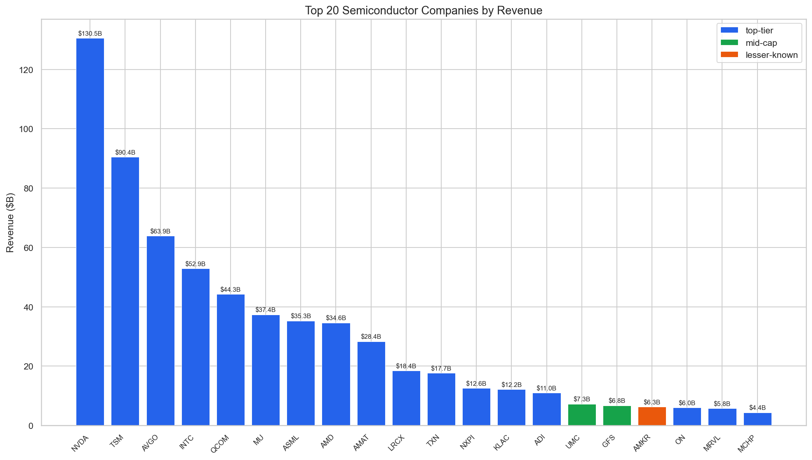
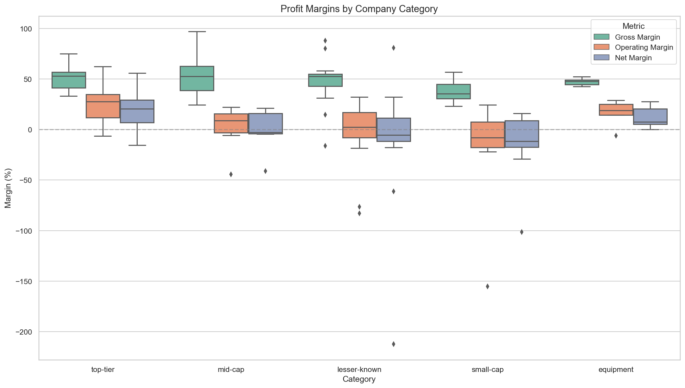
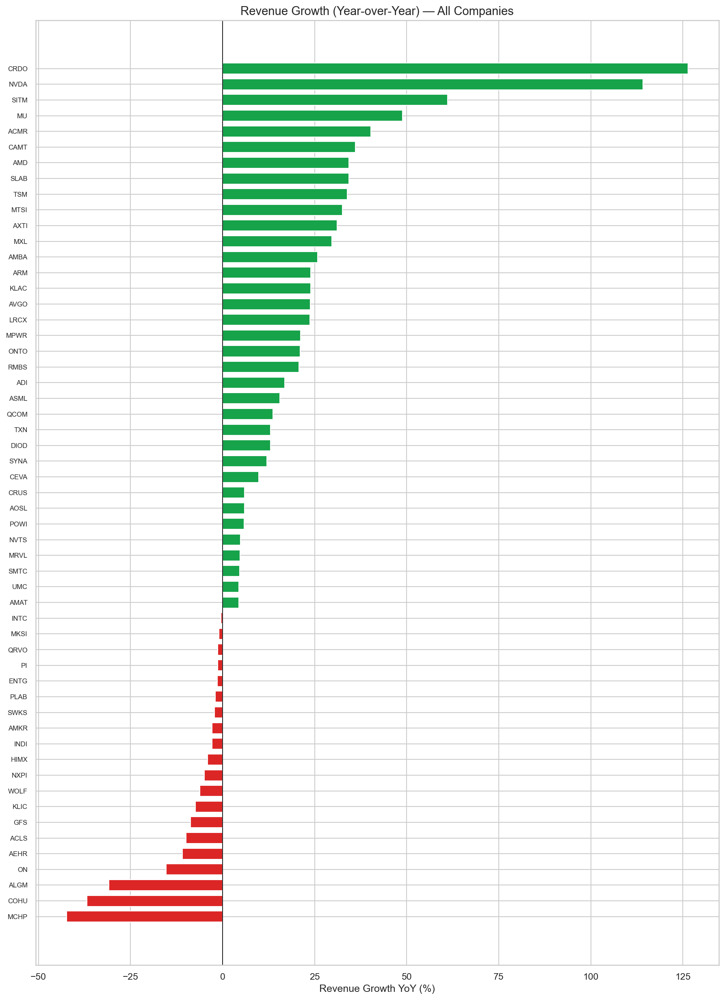
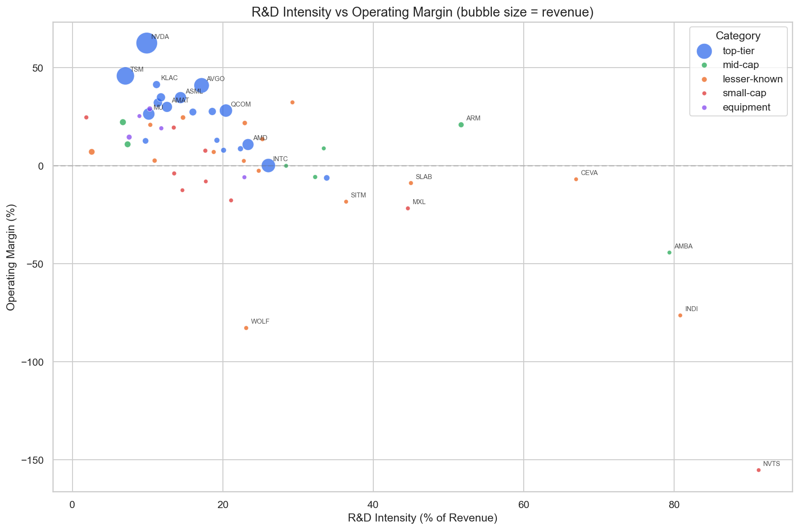
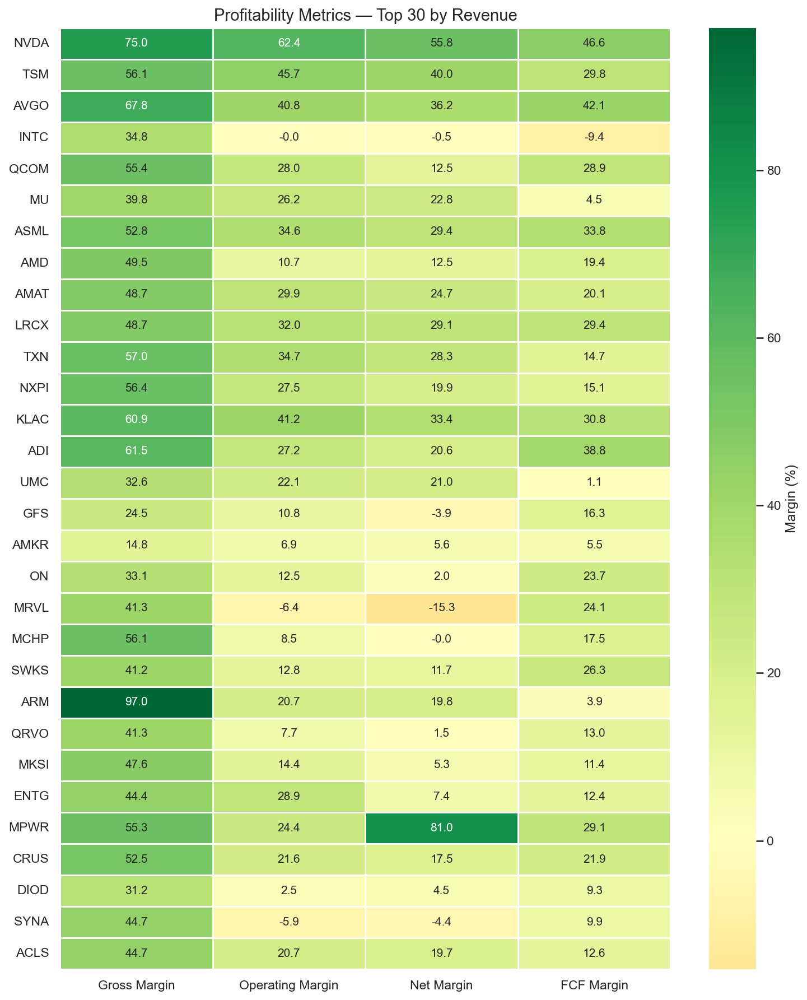
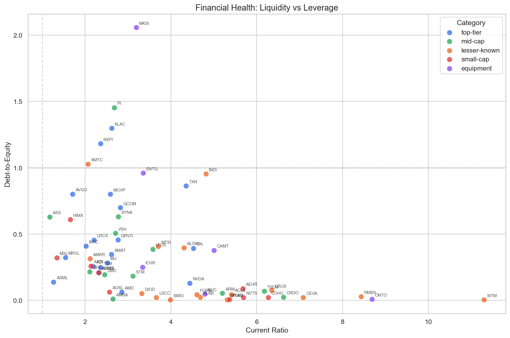

# Semiconductor Company Financials Analysis

Financial analysis of **64 publicly traded semiconductor companies** across 5 market categories, covering revenue, profitability, R&D intensity, and financial health metrics.

## Coverage

| Category | Companies | Examples |
|----------|-----------|---------|
| Top-Tier | 19 | NVDA, AMD, INTC, QCOM, AVGO, TSM, ASML, LRCX, KLAC, AMAT |
| Mid-Cap | 12 | ARM, GFS, STM, UMC, ASX, TSEM, AMBA, SYNA, CRDO |
| Lesser-Known | 18 | WOLF, CRUS, LSCC, MPWR, SITM, SMTC, RMBS, ALGM |
| Small-Cap | 9 | HIMX, MXL, NVTS, AOSL, AXTI, AEHR, COHU, PLAB, ACMR |
| Equipment | 6 | ENTG, ONTO, MKSI, ICHR, KLIC, CAMT |

Full list in [`companies.csv`](companies.csv).

## Data Structure

```
data/
├── annual/
│   ├── income_statement/   # 64 files
│   ├── balance_sheet/      # 64 files
│   └── cash_flow/          # 64 files
└── quarterly/
    ├── income_statement/
    ├── balance_sheet/
    └── cash_flow/
```

Financial statements sourced via `yfinance`. Each CSV contains dates as rows and line items as columns (e.g., `NVDA_income_statement_annual.csv`).

## Key Metrics (15)

| Metric | Description |
|--------|-------------|
| `revenue` | Total revenue (USD) |
| `revenue_growth_yoy` | Year-over-year revenue growth |
| `gross_margin` | Gross Profit / Revenue |
| `operating_margin` | Operating Income / Revenue |
| `net_margin` | Net Income / Revenue |
| `ebitda_margin` | EBITDA / Revenue |
| `rd_intensity` | R&D Spending / Revenue |
| `eps_diluted` | Diluted Earnings Per Share |
| `free_cash_flow` | Operating Cash Flow - CapEx |
| `fcf_margin` | Free Cash Flow / Revenue |
| `roe` | Return on Equity |
| `roa` | Return on Assets |
| `current_ratio` | Current Assets / Current Liabilities |
| `debt_to_equity` | Total Debt / Stockholders' Equity |
| `cash_position` | Cash and Cash Equivalents |

Results saved to [`analysis_results.csv`](analysis_results.csv) (64 rows, sorted by revenue descending).

## Visualizations

Generated in [`charts/`](charts/):

| Chart | Description |
|-------|-------------|
|  | **Top 20 by Revenue** — Bar chart color-coded by category, values in billions USD |
|  | **Margins by Category** — Box plots comparing gross, operating, and net margins across categories |
|  | **Revenue Growth Ranking** — All 64 companies sorted by YoY growth (green = positive, red = negative) |
|  | **R&D vs Operating Margin** — Bubble scatter (size = revenue), showing innovation vs profitability tradeoff |
|  | **Profitability Heatmap** — Top 30 companies across 4 margin metrics (red-yellow-green scale) |
|  | **Financial Health** — Current Ratio vs Debt-to-Equity scatter with healthy-zone reference lines |

## Currency Normalization

Three companies report in non-USD currencies and are converted using approximate 2024 average rates:

| Company | Ticker | Currency | Rate |
|---------|--------|----------|------|
| Taiwan Semiconductor | TSM | TWD | 1 TWD = 0.03125 USD |
| United Microelectronics | UMC | TWD | 1 TWD = 0.03125 USD |
| ASML Holding | ASML | EUR | 1 EUR = 1.08 USD |

## How to Run

**Prerequisites:** Python 3

```bash
# Install dependencies
pip install -r requirements.txt

# Collect financial data (fetches from Yahoo Finance)
python3 collect_financials.py

# Run analysis and generate charts
python3 analyze_financials.py
```

`analyze_financials.py` loads the data, computes all 15 metrics, exports `analysis_results.csv`, generates 6 charts in `charts/`, and prints a summary report to the console.
